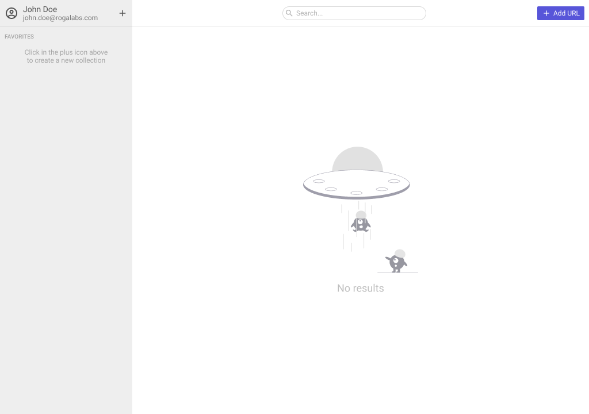
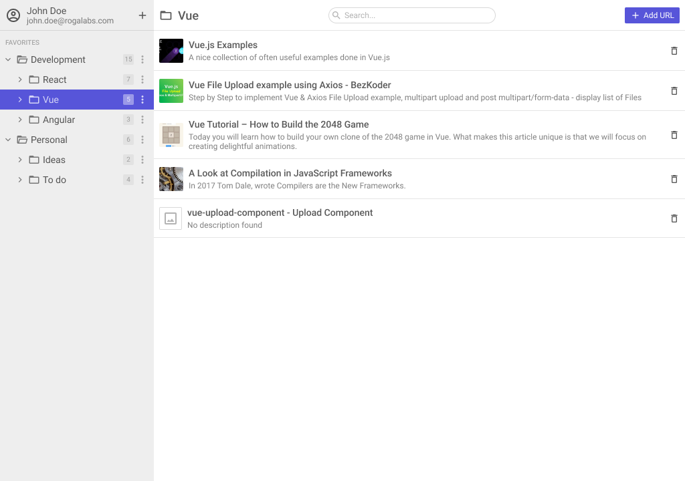
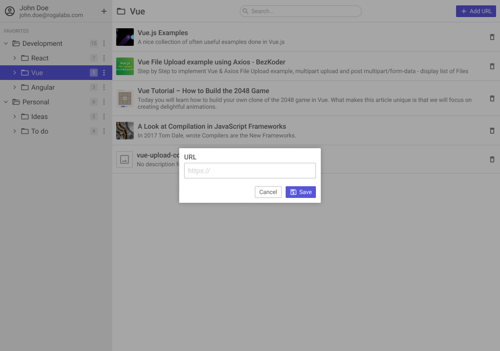

# Bookmark Manager

Gerenciador de favoritos ([Raindrop](https://raindrop.io/) clone).

## Pré-requisitos

- Node.js 16+.
- Criar o projeto usando [ReactJS](https://reactjs.org/).
- Não utilizar nenhuma biblioteca adicional (ex: styled-components ou qualquer [css-in-js](https://cssinjs.org/)) além daquelas instaladas.
- Utilizar o "bom e velho" CSS e JS (mostre suas habilidades! Nada de coisas de terceiros 😉).

## Passos

- Rodar (em terminais separados) os comandos `npm run serve` e `npm start`
- Criar a interface baseada no [protótipo do Figma](https://www.figma.com/file/fJ43ch89xzrAcCl5aN16JT/Bookmark-Manager).
- Utilizar o endpoint `/api/extract` para obter os metadados das URLs.
- Utilizar [json-server](https://github.com/typicode/json-server) para salvar os favoritos.

## Sugestões

- Utilize animações CSS;
- Utilize alguma metodologia de organização de CSS ([BEM](http://getbem.com/), [SMACSS](http://smacss.com/), [SuitCSS](http://suitcss.github.io/), etc — Seja consistente!);
- Procure deixar os componentes ou funções reutilizáveis (evite acoplamento);
- Procure detectar renderizações desnecessárias. Dica: utilize [useWhyDidYouUpdate](https://usehooks.com/useWhyDidYouUpdate/);
- Se possível, faça [code-splitting](https://reactjs.org/docs/code-splitting.html).
- Crie teste unitários.

## O que será avaliado

- Responsividade;
- Fidelidade ao protótipo;
- Familiaridade com CSS, JS e React;
- Estrutura do código (padrões, estrutura de pastas, etc);
- Uso de boas práticas (legibilidade, código limpo, etc);
- Funcionalidades adicionais são bem-vindas (use sua criatividade).

## Resultado esperado

-- _Empty State_

-- _Menu hover_

-- _Menu active_

-- _Menu actions_

-- _Add/Edit group_

-- _Add URL_
